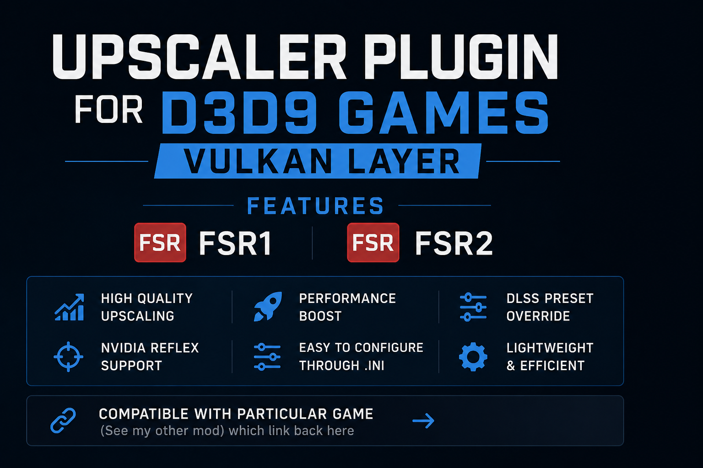

# GamePlug D3D9 Vulkan Upscaler Plugin

Universal DirectX 9 upscaler powered by **GamePlug** with AMD FSR1 and FSR2 support. Improves image quality and performance scaling in DirectX 9 games.

GamePlug Upscaler brings modern upscaling support to DirectX 9 games using the GamePlug framework. The current version implements AMD FSR1 and FSR2 for sharper image quality and improved performance scaling in older D3D9 titles.

> [!IMPORTANT]
> **Key Difference:**  
> This mod (`upscaler_vk.dll`) uses **Vulkan upscaling** for better image quality than `upscaler_d3d9`. It must be used in conjunction with DXVK's `d3d9.dll` and the GamePlug Vulkan layer mod for the respective game (which links back to this upscaler).

---

## Features

- **Universal DirectX 9 upscaler** utilizing Vulkan
- **DXVK Integration:** Designed to work seamlessly with DXVK through the Vulkan Layer
- **Future-Proof:** Aims to open the path for other upscaler types in the future
- **AMD FSR1 & FSR2** implementation
- **Plugin-based architecture** powered by GamePlug Labs
- **Lightweight DLL-based injection**
- **Designed for compatibility** with older PC games

---

## Downloads

*Optional: Download files required for FSR2 upscaling.*

- **FSR2 v2.2.1 files**: [FidelityFX FSR2 Releases](https://github.com/rohitsoni007/FidelityFX-FSR2/releases/tag/v2.2.1)

---

## Installation

1. **Extract the downloaded files.**
2. **Place the following files** into the same folder as your game executable (`.exe`):
   - `upscaler_vk.dll` *(acts as the injector for a particular game that links back to this upscaler)*
   - `dinput8.dll`
   - `vklayer.dll`
   - `VK_LAYER_GAMEPLUG.json`
   - `d3d9.dll` *(DXVK)*
   - **For FSR2 support (Required):**
     - `ffx_fsr2_api_x86.dll`
     - `ffx_fsr2_api_vk_x86.dll`
3. **Launch the game.**

---

## Framework

Powered by [GamePlug](https://github.com/gameplug-labs).

Join the [GamePlug Discord](https://discord.gg/TyyDD3C7wQ) for announcements, news, and new features!
